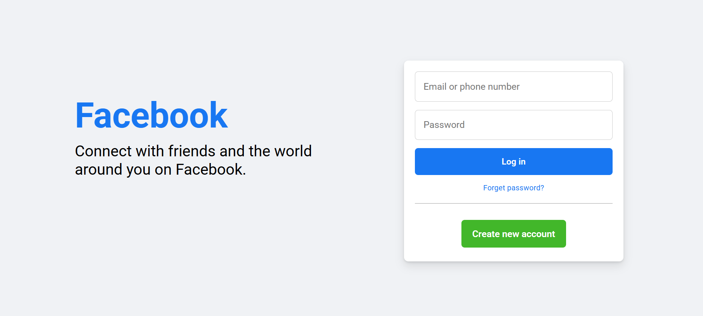

📘 Responsive-Facebook-login

A responsive Facebook Login Page UI Clone built using HTML5 and CSS3.
This project replicates the design of the Facebook login interface and focuses on responsive layout and modern styling.

🚀 Features

Responsive design

Clean UI layout

Modern CSS styling

Flexbox layout

Google Fonts integration

Mobile friendly design

Hover effects

🛠️ Technologies Used

HTML5

CSS3

Flexbox

Media Queries

Google Fonts

📱 Responsive Design

This project adapts to different screen sizes:

Desktop
Tablet
Mobile

🎯 Learning Purpose

This project was created to practice:

HTML structure

CSS layout

Flexbox

Responsive design using media queries

UI cloning

## Preview

👩‍💻 Author
Shalu Muskan
